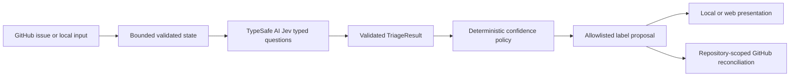

# JevFlow — Confidence-Aware GitHub Issue Triage powered by Jev

JevFlow turns a GitHub issue into typed triage recommendations, applies a deterministic confidence policy, and proposes a small allowlisted set of labels. Uncertain, critical, or security-sensitive results are routed to a maintainer instead of being treated as safe automation.

OpenAI Codex helped build and review this project. **TypeSafe AI Jev is the runtime inference provider.** JevFlow does not use OpenAI for application inference.

## Project status

JevFlow is a local, offline-verified v0.1.0 MVP candidate. Live Jev inference, GitHub-hosted issue mutation, public web deployment, and release publication have not been performed during development.

| Capability                                            | Status                                                | Live credentials                                |
| ----------------------------------------------------- | ----------------------------------------------------- | ----------------------------------------------- |
| Strict TypeScript core, confidence policy, CLI, tests | Implemented and verified offline                      | None                                            |
| 30-case synthetic fixture evaluation                  | Implemented; measures harness and policy behavior     | None                                            |
| Responsive Next.js preview dashboard                  | Implemented; synthetic fixture mode works offline     | None                                            |
| Read-only public repository browser                   | Implemented; public GitHub reads, no repository write | None                                            |
| Local CLI analysis with Jev                           | Implemented; deliberate live command                  | `TYPESAFE_API_KEY`                              |
| GitHub Actions issue labeling                         | Implemented and statically reviewed; live run pending | Repository secret plus automatic `GITHUB_TOKEN` |
| Dashboard live analysis                               | Development-only, disabled by default                 | Server-side `TYPESAFE_API_KEY`                  |
| Public hosted service, authentication, database       | Not implemented                                       | —                                               |

## How it works



Jev answers three `choice` questions (`issueType`, `engineeringArea`, and `priority`) and two binary questions (`securitySensitive` and `needsHumanReview`). Choice `selectedProbability` and provider-reported `confidence` are kept separate. Binary values are P(YES), not confidence scores and not proof of a security incident.

The application policy gates choices using the weaker of selected probability and reported confidence, then uses the weakest of the three choices. Critical priority, security P(YES), needs-review P(YES), and truncated input can only increase review requirements. These thresholds are project heuristics, not provider calibration guarantees.

## Requirements

- Node.js 20.19 or newer (`.nvmrc` selects Node 20)
- npm with the committed lockfiles
- A TypeSafe AI key only for deliberately invoked live Jev paths
- GitHub Actions secrets and repository permissions only for live issue automation

## Install and verify

Use the committed lockfile for a reproducible root install:

```bash
npm ci
npm run check
```

Useful root commands:

```bash
npm run dev
npm run build
npm start
npm run triage -- --help
npm run eval -- --help
```

`npm run dev`, `npm start`, both help commands, tests, builds, and fixture evaluation are offline. See [development.md](docs/development.md) for PowerShell setup and troubleshooting.

## Environment configuration

Copy `.env.example` to an ignored `.env` only when local overrides are needed:

```powershell
Copy-Item .env.example .env
```

The example contains empty placeholders for `TYPESAFE_API_KEY` and `GITHUB_TOKEN`, plus the default policy thresholds. Never commit `.env`, paste credentials into a command, use a `NEXT_PUBLIC_` secret, or expose a key to browser code.

## Local issue CLI

The committed example is synthetic. Help is offline:

```bash
npm run triage -- --help
```

The following commands make one live application-level Jev request and can consume paid capacity:

```bash
npm run triage -- --file examples/sample-issue.json
npm run triage -- --file examples/sample-issue.json --json
```

Human output explains decisions, policy, and proposed labels. `--json` writes one machine-readable JSON document. Neither mode mutates GitHub.

## Offline evaluation

Run the deterministic 30-case synthetic fixture suite:

```bash
npm run eval -- --mode fixture
npm run eval -- --mode fixture --format json --output evals/results/task07-offline.json
```

Generated JSON and Markdown reports belong under `evals/results/` and are ignored by Git. Fixture reports are labeled `offline-fixture`; they verify dataset loading, metric arithmetic, policy integration, and reporting. They are **not** Jev accuracy, latency, cost, or calibration measurements. See [evaluation.md](docs/evaluation.md).

## Web playground

`web/` is a separate Next.js package with its own lockfile:

```bash
npm ci
npm --prefix web ci
npm --prefix web run dev
npm --prefix web run check
```

Open `http://localhost:3000`. The default Preview Fixture mode uses three clearly labeled synthetic examples and makes no provider request. The `/evaluation` page reads a valid local report when one exists and otherwise shows an honest empty state. The `/repositories` page validates and locally links public GitHub repositories, then reads actual public issues through server-only routes. Opening an issue in the playground prefills its text without starting inference or modifying GitHub.

Live dashboard requests require an ignored `web/.env.local`, `JEVFLOW_LIVE_DEMO_ENABLED=true`, and a server-only `TYPESAFE_API_KEY`. The route is disabled in production and the dashboard never writes to GitHub. Public repository browsing requires no TypeSafe key or GitHub token and remains subject to GitHub's unauthenticated API limits. See [Connected Repositories](docs/connected-repositories.md) and [web/README.md](web/README.md).

## GitHub Actions installation

The source workflow at [jevflow-triage.yml](.github/workflows/jevflow-triage.yml) handles issues in this repository only. It triggers on `issues: opened` or a manually supplied issue number, requests `contents: read` and `issues: write`, and uses the receiving repository's automatic token.

For a separate disposable repository, place the configured [target template](deploy/target-repo/jevflow-triage.yml) on that repository's default branch. Replace the public source owner and placeholder with a reviewed immutable 40-character JevFlow commit SHA, then add `TYPESAFE_API_KEY` as a secret in the target repository. Tokens and secrets do not transfer from the source repository. Follow [deployment.md](docs/deployment.md) and the [target install guide](deploy/target-repo/README.md).

`security-review` means manual security review is recommended; it does not confirm a vulnerability. The label stays until a human removes it. JevFlow preserves unrelated human labels and reports partial API failures in the Actions summary.

## Security and privacy

Issue titles and bodies are untrusted input. JevFlow validates and bounds them before inference, uses a static label allowlist, keeps provider and GitHub errors sanitized, and isolates server credentials from browser modules. Live analysis sends issue content to TypeSafe AI Jev under the provider's applicable terms. Do not use sensitive production issues until privacy, retention, access, and cost requirements have been reviewed.

See [security.md](docs/security.md) for the threat model and known limits. JevFlow is not a vulnerability scanner and has no security certification.

## Demo and screenshots

Screenshots are **pending capture**. No generated image is presented as a real product or Actions run. The [demo guide](docs/demo-guide.md) contains a 60–90 second storyboard and an evidence checklist for local capture.

## Limitations

- Live Jev behavior and provider latency have not been measured in this release preparation.
- The 30 synthetic cases are not representative production data.
- GitHub workflows have been reviewed and tested with injected offline adapters, but have not been installed and observed on `jevflow-test-repo`.
- The local dashboard live route is intentionally unavailable in production; a hosted live service needs authentication, rate limits, abuse controls, and a separate review.
- License selection, public URLs, release/tag creation, deployment, and publication remain pending.

## Documentation

- [Architecture](docs/architecture.md)
- [Development](docs/development.md)
- [Testing](docs/testing.md)
- [Evaluation](docs/evaluation.md)
- [Security](docs/security.md)
- [Deployment](docs/deployment.md)
- [Connected repositories](docs/connected-repositories.md)
- [Release readiness report](docs/release-report.md)
- [Roadmap](docs/roadmap.md)

## Contributing

Create a focused branch from verified `main`, preserve the module boundaries in `AGENTS.md`, run root and web checks when affected, and review staged changes for credentials before committing. Live provider or GitHub testing requires separate explicit authorization.

## License

**License pending.** No license file has been selected by the project owner. Public reuse terms must not be assumed until a license is chosen and added.
